# link-up

<div align="center">


### 企业级数据同步工具

*LinkUp 是一款开箱即用的数据同步工具，深度集成 Apache SeaTunnel，提供从自动建表、任务调度到日志监控的全链路能力，界面直观，非技术人员也能轻松上手。*

**[💡 功能建议]()**

</div>

## 联系方式


## 项目定位
- 本项目定位为轻量级工具，聚焦核心功能。为保持其简洁与高效，我们暂不内置用户、权限等系统级模块，以便开发者更灵活地自行集成。

## 网站地址
- https://linkup.ocean-zhc.com.cn/data-integration/connector
- 多谢【ocean-zhc】提供的cloudflared转发服务

## 系统架构


## 核心优势
1. [**极简配置**]：低代码界面，配置数据同步像填表单一样简单。
2. [**插件扩展**]：支持自定义插件扩展，无缝对接各类数据源与业务系统。
3. [**调度管理**]：内置高可用调度引擎，精准控制任务生命周期与执行策略。
4. [**隔离冲突**]：采用类加载器隔离技术，根治第三方驱动JAR包冲突。
5. [**轻量高并发**]：精简架构，支撑万级QPS，资源最低需2Core 4G。
6. [**可控不超标**]：应对亿级数据同步，内存占用坚决低于1GB。
7. [**内置可观测**]：集成开箱即用的监控可视化，无需复杂集成Prometheus与Grafana。


## 数据源支持情况(已支持14种)
| Source端     | 是否支持                                                          | Sink端   | 是否支持    |
| --------------- | -------------------------------------------------------------------- | --------- | ---------- |
| MySQL | 支持 | MySQL | 支持 |
| Oracle| 支持 | Oracle| 支持 |
| PostgreSql| 支持 | PostgreSql | 支持 |
| SQLServer| 支持 | SQLServer | 支持 |
| MongoDB| 支持 | MongoDB | 支持 |
| DB2| 支持 | DB2 | 支持 |
| Cache| 支持 | Cache| 支持 |
| Elasticsearch7| 支持 | Elasticsearch7 | 支持 |
| OpenGauss| 支持 | OpenGauss| 支持 |
| DaMeng| 支持 | DaMeng| 支持 |
| Doris| 支持 | Doris | 支持 |
| HIVE3| 支持 | HIVE3| 支持 |
| StarRocks | 支持 | StarRocks | 支持 |
| ClickHouse| 支持 | ClickHouse| 支持 |

- 其他数据库会陆续支持，敬请期待~

## 🛠️ 技术架构

### 核心框架
- **后端架构**：Spring Boot 2.7
- **数据存储**：MySQL 8.0
- **前端技术**：Antd5.x

## 部分截图
## 数据源管理
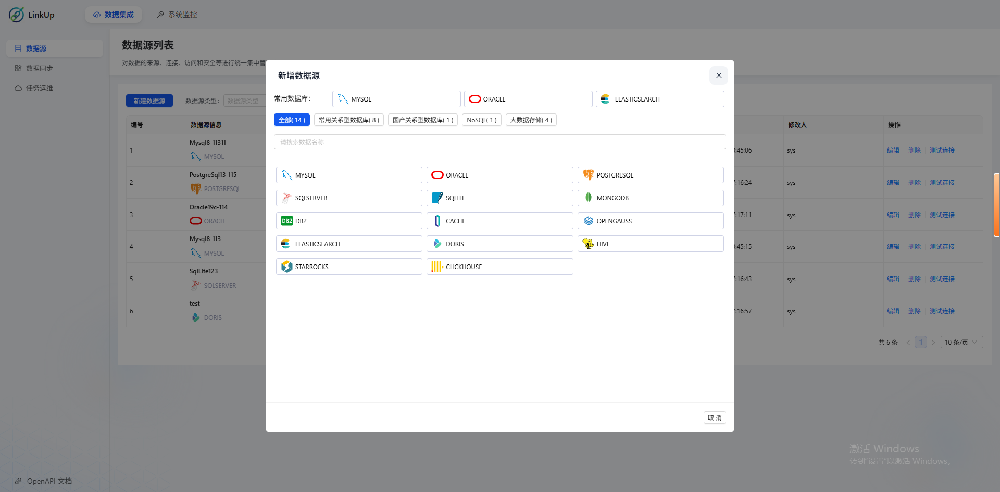
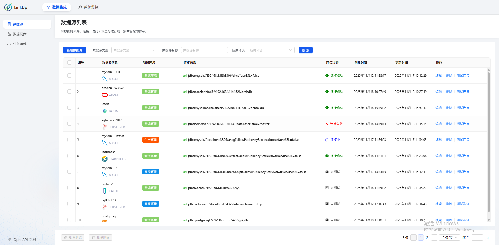
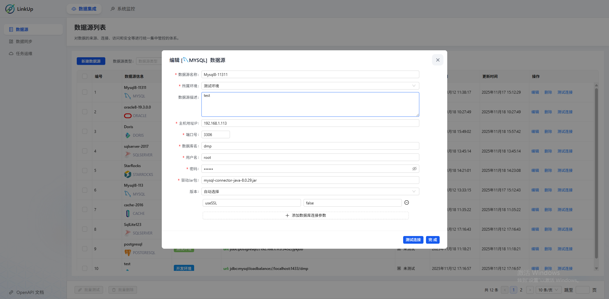
## 数据同步
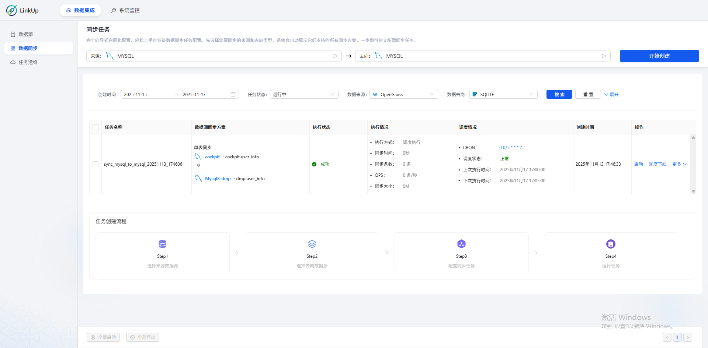
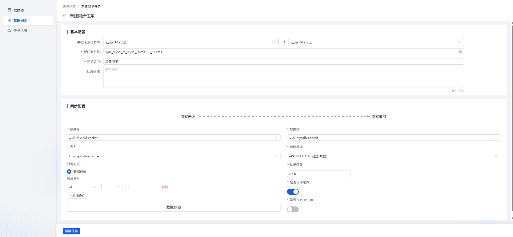
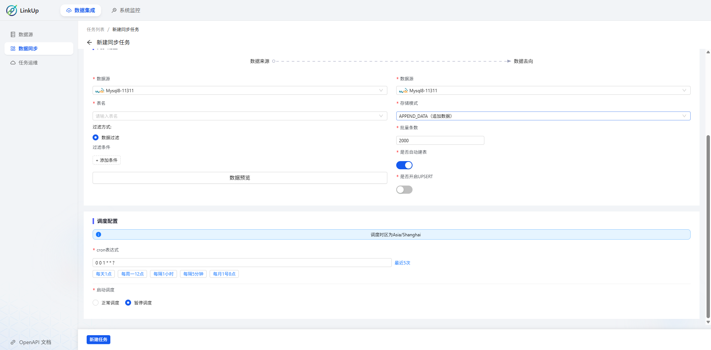
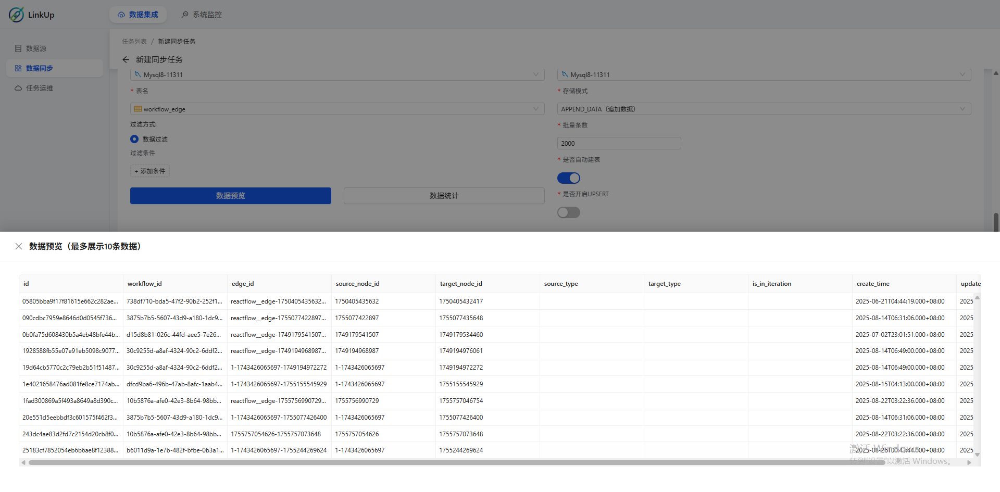
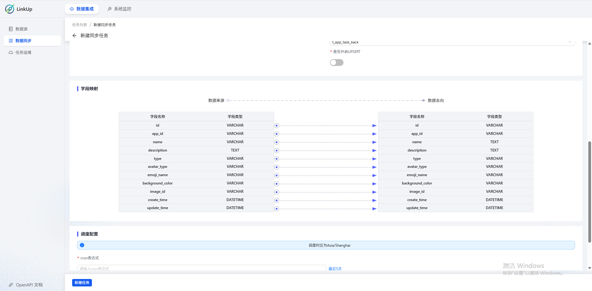
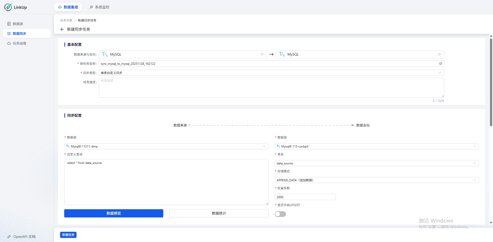
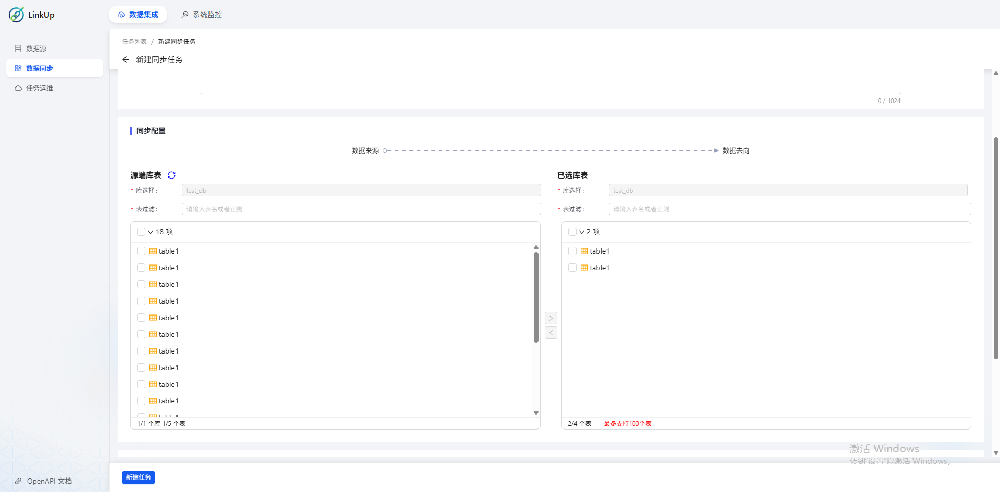
## 运行历史
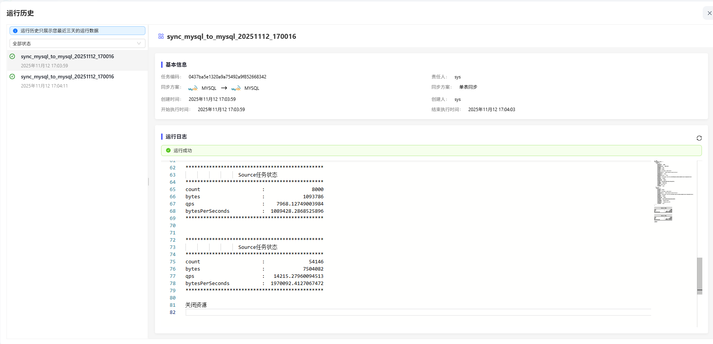
## 任务运维

## 资源监控
- 后续还会扩展更多资源信息，如操作系统指标信息
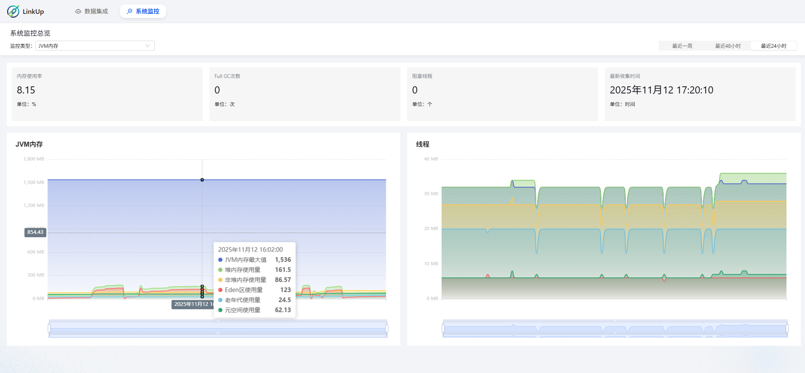


## 版本计划
### 1.0.0 数据同步（进行中）
### 2.0.0 智慧建模（已实现，未集成）
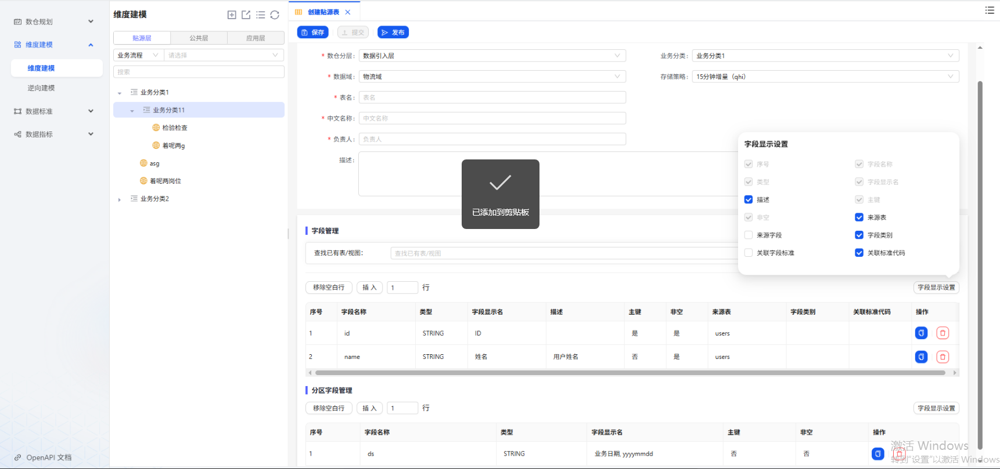
### 3.0.0 数据开发（已实现，未集成）
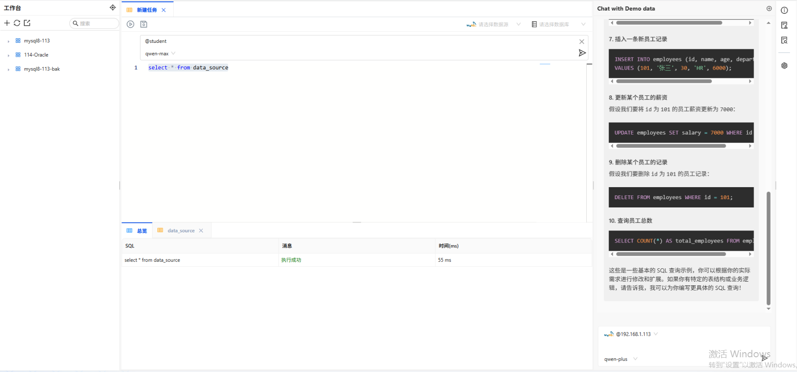
### 4.0.0 工作流引擎 - 前端界面设计灵感源自 Dify，注重现代感与用户体验；后端则使用 Java 构建，确保系统的高性能与稳健性。（已实现，未集成）
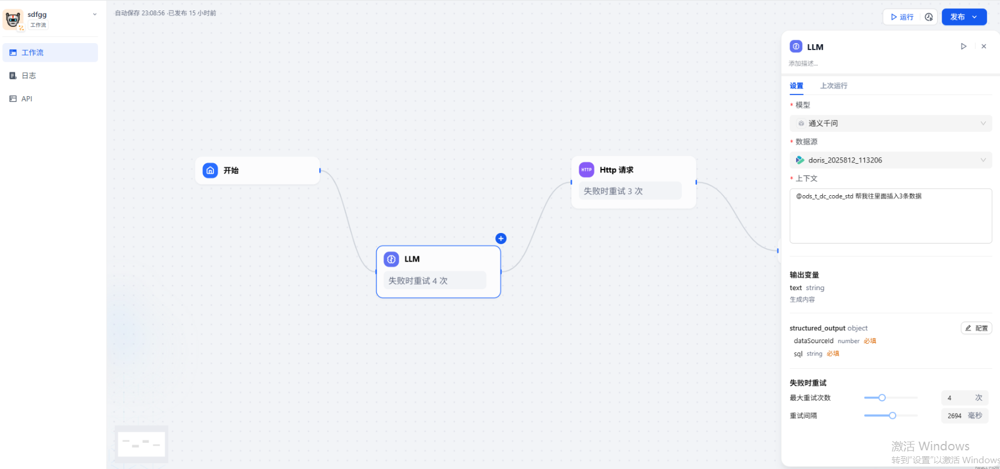

## 部署流程
### 后端 - 就是一个普通的springboot服务
1. 执行cockpit-persistent下面的sql语句
2. 修改application.yml下面的数据库连接、账号、密码
3. ide中执行运行启动即可
4. 如果是linux中，则java -jar 对应的jar包。

### 前端
### 本地调试执行流程
1. 下载node18.2.0，然后安装yarn命令，然后执行yarn安装依赖，最后执行yarn start启动
### docker部署流程
2. npm run build打包成dist文件
3. 编写nginx.conf
```
#user  nobody;
worker_processes  1;

events {
    worker_connections  1024;
}

http {
    include       mime.types;
    default_type  application/octet-stream;
    sendfile        on;
    keepalive_timeout  65;
    client_max_body_size 200M;

    server {
        listen  80;
        listen  9001;
        server_name 127.0.0.1;

        location / {
            root   /usr/share/nginx/html;
            index  index.html index.htm;
            try_files $uri $uri/ /index.html;
        }

        location /api/ {
            proxy_pass http://127.0.0.1:9527;
            proxy_set_header Host $host;
            proxy_set_header X-Real-IP $remote_addr;
            proxy_set_header X-Forwarded-For $proxy_add_x_forwarded_for;
            proxy_set_header X-Forwarded-Proto $scheme;
        }

        error_page   500 502 503 504  /50x.html;
        location = /50x.html {
            root   html;
        }
    }
}
```
### 前端启动命令
```
docker run \
-d -p 9001:80 \
--name cockpit-ui \
--privileged=true \
--restart=always \
-v /opt/bigdata/fronted/nginx.conf:/etc/nginx/nginx.conf \
-v /opt/bigdata/fronted/dist:/usr/share/nginx/html \
nginx:latest

```

